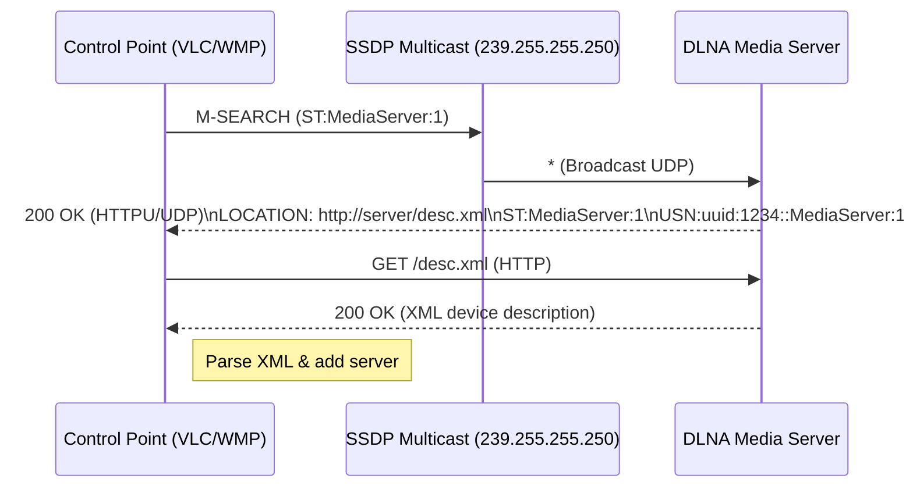

# Executive Summary  
DLNA/UPnP control points (like VLC and Windows Media Player) use **SSDP** over multicast UDP (239.255.255.250:1900 for IPv4, ff02::c:1900 for IPv6) to discover media servers. Both send an M-SEARCH probe and parse SSDP responses to locate servers with a ContentDirectory service. VLC’s cross-platform code (using the Intel libupnp SDK) sends M-SEARCH requests for the MediaServer device type (e.g. `urn:schemas-upnp-org:device:MediaServer:1`)【68†L2708-L2716】【65†L1-L4】 and then fetches the device’s XML from the URL in the SSDP `LOCATION` header. It ensures required XML fields (deviceType, UDN, friendlyName, serviceList with ContentDirectory) are present before adding a server【12†L3151-L3159】【12†L3198-L3207】. Windows Media Player (WMP) uses the native UPnP COM stack (IUPnPDeviceFinder) and follows the same SSDP/UPnP rules: it typically searches for `upnp:rootdevice` or specific device UUIDs and expects the standard `ContentDirectory:1` service in the description. Notably, Microsoft’s SSDP stack on Windows uses IPv6 link-local (ff02::c) and the event port 2869【18†L236-L239】. Key differences are mostly implementation details (VLC spawns a helper thread【68†L2795-L2803】; WMP’s Function Discovery listens continuously for ssdp:alive/byebye events【15†L83-L91】). In summary, both clients adhere to the UPnP Device Architecture spec, but testing shows VLC sends `ST: urn:schemas-upnp-org:device:MediaServer:1` by default, whereas WMP often sends `ST: upnp:rootdevice` and filters for media servers. The tables and checklist below compare their behavior on SSDP headers, XML parsing, and timing.  

## Discovery Protocols (SSDP/UPnP)  
- **SSDP over UDP multicast:** Both clients listen on 239.255.255.250:1900 (IPv4) and ff02::c:1900 (IPv6 link-local)【18†L213-L221】【18†L223-L226】. Windows uses IPv6 link-local specifically (ff02::c) and port 2869 for event subscriptions【18†L236-L239】.  
- **SSDP Messages:** Devices advertise presence with **NOTIFY** (ssdp:alive/byebye), and control points search with **M-SEARCH** (ssdp:discover)【62†L730-L738】【67†L1122-L1126】. Each SSDP message is HTTPU/HTTPMU: a text message over UDP. Required headers in responses include **NT** (Notification Type), **USN** (Unique Service Name), **LOCATION**, and **CACHE-CONTROL**【63†L777-L785】. The `SERVER` header (OS/UPnP versions) is recommended. WMP’s stack logs these fields internally.  
- **Search Targets (ST/NT):** By spec, M-SEARCH uses an `ST` header (e.g. `ssdp:all`, `upnp:rootdevice`, `uuid:device-UUID`, or a device/service type URI)【67†L1122-L1126】【64†L49-L53】. VLC’s code specifically searches for `urn:schemas-upnp-org:device:MediaServer:1` (MediaServer:1)【68†L2708-L2716】【65†L1-L4】, and a SAT>IP type. WMP typically issues `ST: upnp:rootdevice` or the specific UUID and expects the client’s desired type (MediaServer) in the response. Devices respond if their NT/USN matches the ST (e.g. SSDP “rootdevice”, service or device type)【64†L49-L53】.  
- **XML Description:** After a response, both clients fetch the XML at the URL in `LOCATION`. VLC uses libupnp’s `UpnpResolveURL2` to form absolute URLs【12†L3217-L3227】. It then parses XML elements: `<deviceType>`, `<UDN>`, `<friendlyName>`, `<serviceType>`, `<controlURL>`, etc. VLC only keeps devices whose `deviceType` matches a MediaServer (or SatIP server) and that have a ContentDirectory service【12†L3151-L3159】【12†L3198-L3207】. WMP uses the COM API to extract similar elements; official guidance (the “Windows Media Connect Device Compatibility Specification”) implies the device must enumerate the CDS and report `ContentDirectory:1`. Both ignore devices missing these.  
- **mDNS/ZeroConf:** Neither VLC nor WMP uses mDNS for UPnP/DLNA. DLNA discovery is SSDP-based. (Some devices or other ecosystems use mDNS/Bonjour, but WMP/VLC stick to standard SSDP.)  

## SSDP Search Process and Parsing  
- **M-SEARCH Format:** A control point sends, e.g.:  
  ```
  M-SEARCH * HTTP/1.1
  HOST: 239.255.255.250:1900
  MAN: "ssdp:discover"
  MX: 5
  ST: urn:schemas-upnp-org:device:MediaServer:1
  ```  
  where `MX` is wait time in seconds【67†L1122-L1126】. Both VLC and WMP follow this format; VLC’s libupnp automatically includes `MAN: "ssdp:discover"` and uses MX=5 by default【68†L2708-L2716】. WMP’s `FindByType` internally does a similar request (example code uses `IUPnPDeviceFinder::FindByType` with a type URI)【56†L64-L72】.  
- **Retries:** SSDP over UDP is unreliable. Both clients repeat or re-listen to capture all responses. The UPnP spec recommends sending each M-SEARCH **multiple times**【64†L25-L32】. In practice, VLC’s libupnp call runs asynchronously for 5 sec, and internally it sends multiple probes (libupnp does this automatically). The Windows stack documentation notes that synchronous search can take ~9 seconds due to repeat sends【56†L52-L58】. WMP’s stack also listens for late responses: after the initial query it keeps listening for `ssdp:alive` messages, notifying on any new device or byebye【15†L83-L91】.  
- **Response Parsing:** A device’s SSDP reply includes HTTP headers analogous to NOTIFY: for example:  
  ```
  HTTP/1.1 200 OK
  CACHE-CONTROL: max-age=1800
  DATE: ...
  EXT:
  LOCATION: http://192.168.0.2:8200/description.xml
  SERVER: OS/Version UPnP/1.0 MediaServer/1.0
  ST: urn:schemas-upnp-org:device:MediaServer:1
  USN: uuid:abcd-1234-...::urn:schemas-upnp-org:device:MediaServer:1
  ```  
  Both VLC and WMP extract `LOCATION` (device XML URL), `ST`/`NT` (to confirm type), and `USN` (for the UUID). They use `CACHE-CONTROL` (max-age) to know when the advertisement expires. By UPnP rules, `USN` is **required**【63†L777-L785】【64†L85-L88】; `SERVER` and `DATE` are sent by devices for identification but not strictly required. VLC logs warnings if critical fields are missing; WMP’s stack would likely ignore incomplete responses.  

## VLC Discovery Implementation (Windows, Linux, Android)  
VLC uses a single cross-platform module (`modules/services_discovery/upnp.cpp`) built on **libupnp** (Intel’s Portable SDK). The code paths are shared across Windows, Linux and Android (all use libupnp and the same parsing logic【65†L1-L4】【66†L1-L4】). Key points from the source:  
- **Search Thread:** VLC creates a dedicated thread (via `vlc_clone`) for SSDP searches【68†L2795-L2803】. This is because `UpnpSearchAsync` blocks; so a worker thread sends the search and waits for callbacks.  
- **M-SEARCH Calls:** In `SearchThread`, VLC calls:  
  ```cpp
  UpnpSearchAsync(handle, 5, MEDIA_SERVER_DEVICE_TYPE, MEDIA_SERVER_DEVICE_TYPE);
  ```  
  Here `MEDIA_SERVER_DEVICE_TYPE` is defined as `"urn:schemas-upnp-org:device:MediaServer:1"`【65†L1-L4】. This sends an M-SEARCH with `ST: MediaServer:1` and listens up to 5 seconds. VLC also does a second search for SAT>IP servers. If `UpnpSearchAsync` fails, VLC logs an error【68†L2708-L2716】.  
- **Response Handling:** libupnp invokes VLC’s callback (`UpnpAsyncRes`) for each matching device found. VLC then fetches the XML at the given `LOCATION`. In `media_server_list.cpp`, VLC iterates the XML `<device>` element list. It reads `<deviceType>` and skips any device that is not a MediaServer or SAT-IP server【12†L3151-L3159】. It reads the `<UDN>` (unique ID) and checks `getServer(UDN)` to skip duplicates【12†L3138-L3146】. The first `<service>` element that matches `"ContentDirectory:1"` is used to get a `controlURL`【12†L3198-L3207】. VLC resolves this URL (via `UpnpResolveURL2`) into an absolute endpoint to browse. It creates a `MediaServerDesc` object with UDN, friendlyName, and the resolved URL【12†L3233-L3242】. If adding to the list fails, it deletes it.  
- **XML Fields:** VLC expects the device XML to contain at least: `<deviceType>urn:schemas-upnp-org:device:MediaServer:1</deviceType>`, a `<UDN>uuid:...GUID</UDN>`, a `<friendlyName>`, and a `<service>` with `<serviceType>urn:schemas-upnp-org:service:ContentDirectory:1</serviceType>` and `<controlURL>`. Optional icons (`<iconList>`) are parsed for a best icon but not required【13†L3306-L3338】.  
- **Platform Notes:** The code is identical on Windows, Linux, and Android. On Android, the VLC app must have `INTERNET` and `ACCESS_NETWORK_STATE` permissions to send/receive SSDP. Android devices can also filter multicast traffic unless the app layer holds a Wi-Fi multicast lock, so Android discovery failures may be platform/network filtering rather than malformed SSDP. VLC's libupnp handles both IPv4 and IPv6 if available. Threading uses POSIX/Win32 threads abstracted by `vlc_clone`. There are no major differences in protocol logic across OS; differences are only in the underlying socket API (WSA on Windows, BSD sockets on Linux/Android).

## Windows Media Player Discovery Behavior  
- **UPnP Stack & APIs:** WMP uses Windows’ built-in UPnP Control Point (via IUPnPDeviceFinder)【56†L64-L72】. When WMP “Refreshes network” or is first run, it effectively broadcasts a search. The Windows SSDP provider sends M-SEARCH (with MX ~5–10) for device types. Example docs show searching for media players by `urn:schemas-upnp-org:device:mediaplayer...`【56†L64-L72】, but WMP also understands servers (MediaServer:1).  
- **Search Behavior:** WMP tends to search for the **root device** (`ST: upnp:rootdevice`) and the specific UUID of any known device. Control points in Windows often loop `FindByType` on well-known URIs. The response triggers an `IUPnPDeviceFinderCallback` which returns an `IUPnPDevice` for the root. The MediaConnect spec indicates WMP should respond to NT=`upnp:rootdevice` and to its own device type【63†L789-L797】. WMP then queries the returned device object for its services.  
- **Protocol Notes:** Windows MSDN notes that synchronous searches take ~9 seconds and send each M-SEARCH multiple times【56†L52-L58】. The Function Discovery SSDP provider (used by WMP) similarly listens for `ssdp:alive` notifications after the search【15†L83-L91】. If a device sends SSDP “byebye”, WMP removes it from its list【15†L85-L91】.  
- **Expected Fields:** WMP expects the standard SSDP headers. The device description should have `ContentDirectory:1` service; Windows will typically ignore devices without it. The USN (UUID) is mandatory【63†L777-L785】. The Windows Media Connect guidelines suggest the root device announces at least `NT: upnp:rootdevice`, `NT: uuid:...`, and `NT: urn:schemas-upnp-org:device:MediaServer:1`【63†L789-L797】. WMP then reads the `<friendlyName>`, `<UDN>`, and looks for `<serviceType>urn:schemas-upnp-org:service:ContentDirectory:1</serviceType>`.  
- **Quirks:** In practice, WMP’s GUI may take longer to show discovered servers (waiting for the search to complete). It caches discovered devices in the registry. WMP also supports DLNA-specific attributes (like album art thumbnails), but these do not affect basic discovery. Notably, Windows may require “Network Discovery” enabled in OS settings, and some home routers block SSDP.  

## Required/Optional SSDP & UPnP Headers  

- **SSDP Request (M-SEARCH):** Must include `HOST:239.255.255.250:1900`, `MAN:"ssdp:discover"`, `MX:<delay>` and `ST:<target>`【67†L1122-L1126】. Either `ssdp:all`, `upnp:rootdevice`, `uuid:...`, or a device/service URN can be used for ST. VLC specifically uses `ST: urn:schemas-upnp-org:device:MediaServer:1`. WMP may use `upnp:rootdevice` or a particular type.  
- **SSDP Response (to M-SEARCH):** Should include **`ST`** (same as requested target or service type), **`USN`** (device UUID, e.g. `uuid:device-UUID::deviceType`【63†L777-L785】), **`LOCATION`** (URL to XML), **`CACHE-CONTROL`** (max-age), and typically **`SERVER`** (OS/UPnP version string). According to UPnP, NT (Notification Type) is present in unsolicited NOTIFY, while in M-SEARCH *responses*, ST is used. Either way, **USN is required**【64†L85-L88】【63†L777-L785】. A missing LOCATION or malformed XML causes clients to skip the device.  
- **Device Description XML:** The server must serve valid UPnP device description at the LOCATION URL. Required elements (in `<root>…<device>`) include: `<deviceType>` (should match a MediaServer, e.g. `MediaServer:1`), `<UDN>` (unique UUID), `<friendlyName>`. If the device has services, it must list each in a `<serviceList>` with `<serviceType>`, `<serviceId>`, and `<controlURL>`. For DLNA, the `<serviceType>` `ContentDirectory:1` must be present【12†L3198-L3207】. WMP and VLC both use only the ContentDirectory service for browsing media. Other XML fields (manufacturer, model, iconList) are optional or used only for UI.  
- **Multiple NICs/Duplicates:** A well-behaved server will respond on all interfaces. VLC checks each `USN/UDN` and ignores duplicates: if the same UDN appears twice (e.g. one via IPv4, one IPv6), VLC skips the second【12†L3138-L3146】. WMP likewise will not list the same device twice. If two different devices claim the same UDN, clients will likely list one (first-writer) and warn on the conflict.  
- **Announcements and Expiry:** Per UPnP, servers should periodically re-announce (NOTIFY ssdp:alive) before the `max-age` expires, and send ssdp:byebye on shutdown【62†L730-L738】. Clients expect to refresh devices if not heard from within the cache period. Both VLC and WMP respect the cache (e.g. max-age ~1800s by default) and will remove devices after expiry if no byebye is received.  
- **Timeouts/Scanning:** VLC uses MX=5 and waits that long; if no responses appear, it simply ends the search. WMP’s Function Discovery waits ~9s as noted【56†L52-L58】. Both will retry searches if the user refreshes. There is typically no hard retry limit aside from user action; WMP shows a “Searching for media devices” spinner for several seconds when enabled.  

## VLC vs WMP: Key Comparison  

| **Feature**                         | **VLC (Win/Linux/Android)**                                      | **Windows Media Player (Win)**                                |
|-------------------------------------|------------------------------------------------------------------|--------------------------------------------------------------|
| **Discovery API**                   | Intel libupnp control point (C/C++)【68†L2795-L2803】             | Windows UPnP Control Point COM (IUPnPDeviceFinder)【56†L64-L72】 |
| **SSDP Search (M-SEARCH)**          | Sends `ST: urn:schemas-upnp-org:device:MediaServer:1`【68†L2708-L2716】【65†L1-L4】 (also SatIP). Uses MX=5.  | Typically sends `ST: upnp:rootdevice` or specific device types (e.g. MediaServer). MX≈5–9. May send multiple queries internally. |
| **Expected NT/ST Values**           | Looks for NT=`MediaServer:1` in responses; also recognizes NT=`SatIPServer:1`.  | Responds to ST=`upnp:rootdevice`, UUID, or MediaServer types【64†L49-L53】. Treats upnp:rootdevice as match. |
| **LOCATION Parsing**                | Uses `UpnpResolveURL2(base, controlURL)` to build URL【12†L3217-L3227】. Accepts HTTP. SSL not used.  | Gets `LocationURL` via IUPnPDevice methods. Requires reachable HTTP (WMP on Win7+ might handle some HTTPS for DLNA URLs). |
| **Device Description Schema**       | Requires `<deviceType>MediaServer:1</deviceType>`, `<UDN>`, `<serviceType>ContentDirectory:1</serviceType>`【12†L3198-L3207】. Ignores others. | Similar: expects ContentDirectory service. Based on UPnP DA spec【63†L777-L785】. WMP’s SDK docs note using those UPNP urns. |
| **Timeouts/Retries**               | libupnp waits up to MX seconds (5s) and collects responses. Retries via background listening on separate thread【68†L2795-L2803】. | Sync search ~9s【56†L52-L58】. Function Discovery notifies on new `ssdp:alive` after initial scan【15†L83-L91】. No explicit retry count. |
| **IPv4/IPv6**                      | Supports IPv4; IPv6 optional (if libupnp built that way). Uses 239.255.255.250 (site-local)【18†L213-L221】 and may use ff02::c if enabled.  | Uses IPv4 239.255.255.250:1900. IPv6: uses link-local ff02::c for SSDP【18†L236-L239】. |
| **Duplicate Handling**              | Checks UDN uniqueness: skips duplicate UDNs【12†L3138-L3146】. Server listing shows one entry per UUID. | Windows merges multiple responses by USN. A device sending two NOTIFYs with the same USN is treated as one. |
| **SSDP Headers**                    | Expects `USN`, `LOCATION`, `CACHE-CONTROL`, `SERVER`. Ignores irrelevant headers.  | Requires `USN`, `LOCATION`. Also processes `SERVER`, `EXT:` (for HTTPSSDP). Per MSDN, any compliant SSDP response is accepted. |
| **Platform Permissions**            | On Android, requires network permissions; on Linux/Win no special privileges beyond normal networking. | On Windows, “Network discovery” must be enabled. SSDP provider service must run. Firewalls may block. |
| **Behavior on Alive/Bye**          | Only does an active search when enabled. Does not auto-discover new servers unless user refreshes (no persistent listener). | Automatically updates view: new devices (ssdp:alive) show up; `byebye` removes devices【15†L83-L91】. |

## Compatibility Checklist for a DLNA Server  
To ensure VLC and WMP clients discover and browse your server correctly, confirm all of the following:  

- **SSDP Announcements:** Upon startup, multicast SSDP `NOTIFY` to 239.255.255.250:1900 (IPv4) and/or ff02::c:1900 (IPv6). Send at least three `NT: upnp:rootdevice` messages (per UDA) and one `NT: urn:schemas-upnp-org:device:MediaServer:1`【63†L777-L785】【63†L789-L797】. Include `USN: uuid:<UDN>::upnp:rootdevice` and `USN: uuid:<UDN>::urn:schemas-upnp-org:device:MediaServer:1`. Include `CACHE-CONTROL: max-age=1800` (or desired expiry) and a `LOCATION` header with your description XML URL. Repeat announcements before cache expiry. On shutdown, send `ssdp:byebye` to expire entries.  
- **Responding to Search:** Listen on SSDP multicast. On M-SEARCH for `upnp:rootdevice`, `ssdp:all`, your UUID, or `MediaServer:1`, send a unicast HTTP/1.1 200 OK response to the sender. Populate headers: `CACHE-CONTROL`, `EXT:`, `LOCATION`, `SERVER`, `ST` (matching the requested search target or device/service type), `USN` (as above)【63†L777-L785】【64†L49-L53】. If MX is given, respond within MX seconds. If multiple NICs/IPs, respond from each or from one (both clients handle duplicates).  
- **Description XML:** Host an XML file at the `LOCATION` URL (HTTP). It must contain `<device><deviceType>urn:schemas-upnp-org:device:MediaServer:1</deviceType><UDN>uuid:<UID></UDN><friendlyName>Your Server Name</friendlyName>…<serviceList><service><serviceType>urn:schemas-upnp-org:service:ContentDirectory:1</serviceType><controlURL>/control/</controlURL>…</service></serviceList>…</device></root>`. Include a valid `<presentationURL>` or icons if desired. Ensure the ContentDirectory service has a correct Control URL.  
- **ContentDirectory Compliance:** Implement the ContentDirectory (Browse/Search) actions as per UPnP AV spec (not detailed here). WMP and VLC will only list content if they can browse your ContentDirectory.  
- **Headers:** Support at minimum `LOCATION`, `USN`, `NT` (or `ST`), and `CACHE-CONTROL`. Include a `SERVER` string (e.g. `ServerOS/1.0 UPnP/1.1 DLNACert/` etc) to identify version. Avoid superfluous headers that might confuse parsers.  
- **Timing:** Respond promptly (within a few seconds) to searches, before the control point times out. Periodically re-announce alive messages (e.g. every 30 minutes) so clients know you’re still present.  
- **Multicast Group:** If on a network with VLANs or multiple interfaces, send SSDP messages to the SSDP multicast group on each interface. Both VLC and Windows will listen on all interfaces by default.  
- **IPv6:** If supporting IPv6, listen on ff02::c for SSDP and respond from a link-local address (scope ID must be included in the LOCATION URL if used). If not, it’s acceptable to only support IPv4.  
- **Robustness:** Tolerate receiving multiple identical M-SEARCH packets (clients send duplicates). Also tolerate simultaneous SSDP from multiple servers. Ensure your `USN` (UDN) is truly unique (e.g. a stable UUID).  

## Recommended Test Cases  
1. **Basic Discovery:** Run a standard SSDP M-SEARCH from a client (e.g. using `upnp-inspector` or Wireshark). Verify your server responds with correct `ST`, `USN`, and `LOCATION`. Both VLC and WMP should list the server after this.  
2. **Root Device Search:** Send `ST: upnp:rootdevice`. Ensure your server replies with an entry for the root device (NT or ST=upnp:rootdevice and USN containing `::upnp:rootdevice`【63†L789-L797】). Both clients should find the server under this search.  
3. **Cache-Control Handling:** Send a slow or partial response to see if clients still accept it. Ensure `CACHE-CONTROL` is present and that after max-age seconds, clients refresh or drop the server if no announce.  
4. **Service Listing:** Confirm the XML at `LOCATION` has the ContentDirectory service. Test that VLC can browse the ContentDirectory (it should call controlURL). Test WMP by adding a library and browsing the remote media. Missing the service or invalid controlURL should make clients ignore the server.  
5. **Duplicate USN:** Run two instances of your server with the same UDN. Observe that clients (VLC/WMP) list only one entry or warn about duplicates. VLC should skip the duplicate (see code)【12†L3138-L3146】.  
6. **IPv6 Discovery:** If your network has IPv6, verify VLC/WMP finds the server via IPv6 SSDP (`ff02::c`). Send an IPv6 M-SEARCH and check responses.  
7. **Multiple Interfaces:** Place the server on a machine with multiple NICs. Ensure clients do not list the same server twice (they should use the UDN check).  
8. **Node Failure:** Bring the server down (or send an explicit ssdp:byebye). Confirm VLC and WMP remove it from their lists.  
9. **Latency/Timeout:** Delay your SSDP response beyond MX and MX multiples (simulate packet loss). Check if clients still catch the response or if it’s too late (MX=5 means client waits up to ~5s then stops listening for replies). WMP’s longer wait (9s) may catch slower replies.  
10. **Header Variations:** Test without optional headers (e.g. omit `SERVER` or `DATE`). Ensure clients still accept if all required fields are present. Also test malformed or out-of-order headers to ensure robustness.  



**Sources:** Official UPnP Device Architecture and SSDP spec details【63†L777-L785】【64†L25-L32】; VLC source code (media discovery module)【68†L2708-L2716】【12†L3198-L3207】; Microsoft documentation on SSDP/UPnP and the Function Discovery provider【18†L213-L221】【56†L52-L58】. These confirm the above behaviors and requirements.
