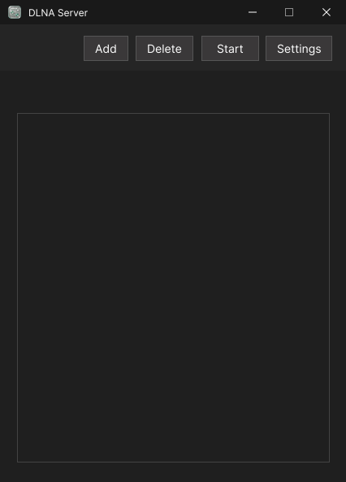
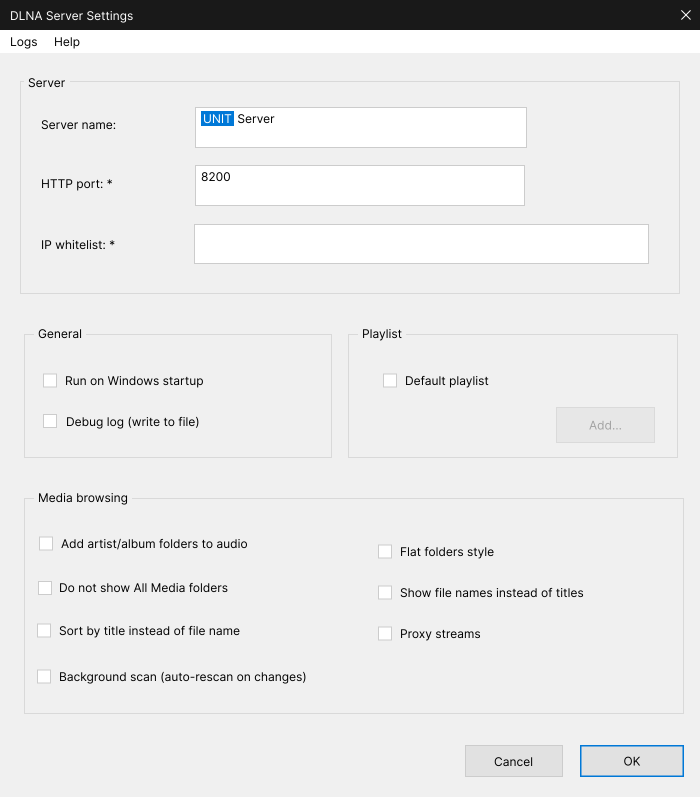
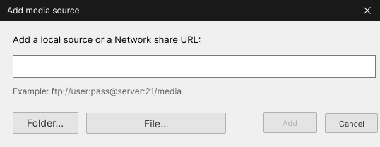
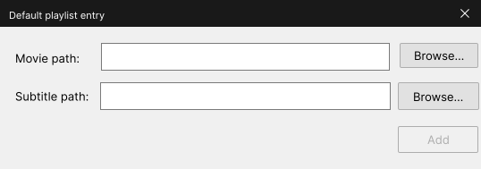
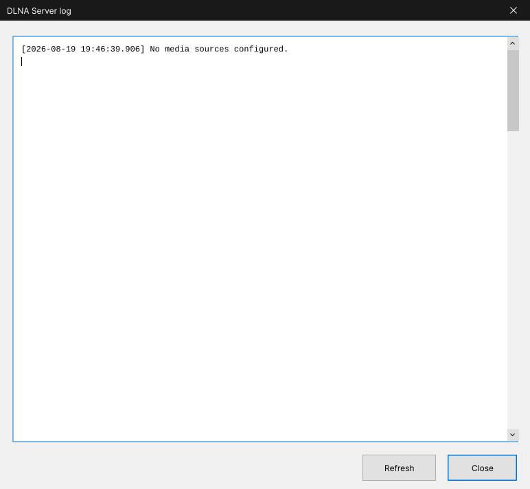
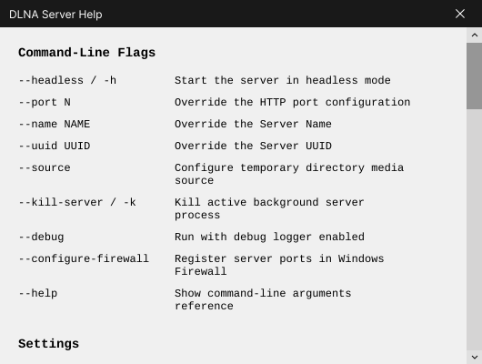
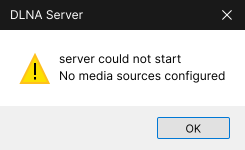

# UI Reference

Mockups for every application window. Source art lives in `docs/media/`.
Titles below are the window captions used in the codebase.

## DLNA Server

## DLNA Server Settings

## Add media source

## Default playlist entry

## DLNA Server Log

## DLNA Server Help

## DLNA Server (server could not start warning)

## WSLg icon and launch identity

The app uses separate values for its internal identity, WSLg window identity,
icon file, and user-visible name. Keep these mappings in sync:

| Value | Required match | Current value |
|---|---|---|
| Internal GTK app ID | Valid reverse-DNS ID passed to `gtk_application_new` | `com.github.dlna_server_14ag` |
| WSLg app ID | Desktop `StartupWMClass` and Wayland toplevel app ID | `dlna_server_14ag` |
| Icon | Desktop `Icon` name and installed PNG basename | `dlna_server_14ag` |
| Display name | Desktop `Name` shown to the user | `DLNA Server` |
| Start Menu target | Desktop `TryExec` must point to the public GUI wrapper | `/usr/bin/dlna-server-gui` |

The GTK application ID must also be valid for D-Bus. CMake derives
`DLNA_GTK_APP_ID` from the internal app ID by replacing hyphens with
underscores. With the current internal ID, both values are the same.

### WSLg Start Menu launch

WSLg reads the desktop entry from `/usr/share/applications`. For the Start Menu
item to appear and launch:

1. The installed desktop file must be named
	`dlna_server_14ag.desktop` and contain the matching `Name`,
	`Icon`, `StartupWMClass`, `Exec`, and `TryExec` values above.
2. `/usr/bin/dlna-server-gui` must exist and be executable. WSLg uses this
	`TryExec` target when it starts the app from Windows. The wrapper checks for
	the native GUI binary before launch.
3. The referenced PNG icon must exist and be readable. WSLg uses this icon for
	the Start Menu item and for the running taskbar entry.
4. WSLg must provide a running Wayland session and a session D-Bus. The GTK
	application ID must be valid for D-Bus so the app can register. The window's
	Wayland app ID must match `StartupWMClass`, so WSLg can attach the running
	window to the same Start Menu entry.

The desktop `Exec` and `TryExec` commands both use `/usr/bin/dlna-server-gui`.
This public wrapper sets fallback WSLg display variables, waits for the Wayland
socket, and starts a session bus with `dbus-run-session` if WSLg did not provide
one. It then starts the native GUI binary. The names shown to users remain `DLNA Server`,
`dlna-server`, and `dlna-server-gui`; users do not need to enter the internal
app ID.
